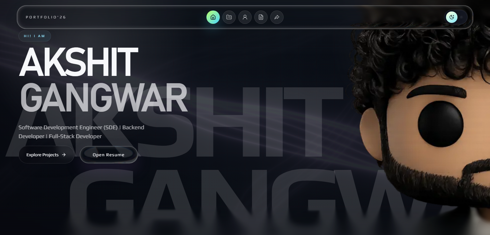

<div align="center">


<a href="https://git.io/typing-svg">
  
</a>


<br />
<br />


<br />

<a href="https://akshitgangwar.vercel.app">
  
</a>
<a href="https://www.linkedin.com/in/akshit-gangwar-b93840282">
  
</a>
<a href="mailto:akshitgangwar02@gmail.com">
  
</a>
<a href="https://github.com/Aksh002">
  
</a>
<a href="https://leetcode.com/u/akki_gang_002">
  
</a>
<a href="https://www.geeksforgeeks.org/user/Aksh002">
  
</a>
<!-- <a href="https://www.hackerrank.com/profile/Aksh002">
  
</a>
<a href="https://www.codechef.com/users/Aksh002">
  
</a> -->
<a href="./Akshit_Gangwar_Resume.pdf">
  
</a>

<br />
<br />


<br />
<br />


</div>

---

<div align="center">


</div>

```json
{
  "name": "Akshit Gangwar",
  "role": "Full-stack Software Engineer",
  "focus": [
    "backend-first full-stack products",
    "API design and database-backed systems",
    "AI-centric product workflows",
    "production deployment and reliability"
  ],
  "core_stack": {
    "frontend": ["Next.js", "React", "TypeScript", "TailwindCSS"],
    "backend": ["FastAPI", "Node.js", "Express", "Hono.js"],
    "data": ["PostgreSQL", "Prisma", "Redis", "Supabase"],
    "cloud": ["Vercel", "Docker", "Cloudflare Workers", "AWS"]
  },
  "current_status": "Looking for software engineering internships and product teams"
}
```

---

<h2 align="center">Portfolio & Resume</h2>

<div align="center">

```txt
+------------------------ recruiter quick-look ------------------------+
| portfolio preview        live website + downloadable resume below     |
+----------------------------------------------------------------------+
```

<a href="https://akshitgangwar.vercel.app">
  
</a>

<br />
<br />

<a href="https://akshitgangwar.vercel.app">
  
</a>
<a href="./Akshit_Gangwar_Resume.pdf">
  
</a>
<a href="mailto:akshitgangwar02@gmail.com">
  
</a>

</div>

---

<h2 align="center">GitHub Analytics</h2>

<div align="center">


<br />
<br />


<br />
<br />


</div>

---

<h2 align="center">About</h2>

I am a full-stack software engineer with a backend-heavy foundation, building production-grade web platforms with strong emphasis on system architecture, API design, authentication, databases, and deployment workflows. My strongest positioning is full-stack product engineering with AI-centric systems: practical LLM workflows, reliable backend pipelines, and user-facing products that ship.

I have designed and shipped applications across Next.js frontends, FastAPI services, serverless edge platforms, PostgreSQL-backed systems, Redis/RQ worker pipelines, authentication layers, and cloud deployment environments. I care about clean architecture, secure ownership boundaries, scalable product workflows, and building software that can survive real users instead of only looking good in a demo.

**Currently looking for**

<div align="center">

| Role Fit | What I Bring |
| :--- | :--- |
| Software Engineering Internships | Full-stack product execution, backend APIs, database design, auth, deployment, and clean delivery |
| Backend / Platform Internships | FastAPI, Node.js, PostgreSQL, Redis/RQ, queues, webhooks, service boundaries, and system design fundamentals |
| AI Product Engineering | LLM-powered workflows, validation/repair loops, prompt-to-code systems, and practical AI features inside real apps |
| Open Source / Product Teams | Strong ownership, readable code, GitHub-based collaboration, and willingness to work across frontend, backend, and infra |

</div>

---

<h2 align="center">Tech Stack</h2>

<h3 align="center">Languages</h3>

<div align="center">
  
</div>

<h3 align="center">Frontend</h3>

<div align="center">
  
</div>

<h3 align="center">Backend & Databases</h3>

<div align="center">
  
</div>

<h3 align="center">Cloud, DevOps & Tooling</h3>

<div align="center">
  
</div>

---

<h2 align="center">Full-Stack + AI Engineering</h2>

<div align="center">

| Domain | Focus | Details |
| :--- | :---: | :--- |
| Full-Stack Product Development | Primary | Next.js interfaces, FastAPI/Node backends, auth flows, dashboards, database-backed workflows, and deployment-ready products |
| AI Application Engineering | Primary | Prompt-to-code generation, repair loops, validation pipelines, Monaco-based editing, and LLM-compatible BYOK workflows |
| Backend Systems | Primary | REST APIs, job queues, Redis/RQ workers, Prisma/PostgreSQL models, service boundaries, and artifact delivery |
| AI Reliability | Applied | AST validation, deterministic repair, sandboxed execution, structured job metadata, retries, and health-check flows |
| Data & ML Foundations | Supporting | Data science minor, ML lab work, analytics coursework, notebook experimentation, and product metrics interpretation |

</div>

---

<h2 align="center">Featured Projects</h2>

```txt
+----------------------+---------------------+--------------------+------------------+
| BUILD                | SYSTEM TYPE         | CORE SIGNAL        | STATUS           |
|----------------------+---------------------+--------------------+------------------|
| Manim AI             | AI video platform   | LLM -> code -> MP4 | active product   |
| Learning Blogger     | edge publishing     | workers + postgres | shipped app      |
| Payments Platform    | fintech backend     | auth + webhooks    | architecture lab |
| Falak'25             | event infra         | 50K+ visitors      | production run   |
| TenFlix ML           | recommendation ML   | temporal drift     | active research  |
| Bengaluru Rent       | map-first product   | rent transparency  | active product   |
| GourmetHub Adv       | full-stack app      | restaurant flows   | product build    |
+----------------------+---------------------+--------------------+------------------+
```

<details open>
<summary><b>AI-Powered Manim Video Generation Platform</b></summary>

<br />

Full-stack prompt-to-video platform that converts educational prompts into validated Manim code with MP4 preview, download flows, signed artifact delivery, and S3/R2-compatible storage.

| Metric | Details |
| :--- | :--- |
| Stack | FastAPI, Python, Next.js, TypeScript, Manim, Auth.js, Prisma, PostgreSQL, Redis, RQ, Docker, S3/R2 |
| Scale | Worker-based generation, rendering, status tracking, regeneration, cancellation, cleanup, and artifact access |
| Performance | Redis/RQ job pipeline with structured metadata, isolated render workers, and async status workflows |
| Security | Auth.js login, Prisma-backed ownership, signed artifact delivery, encrypted BYOK OpenAI-compatible keys |
| Impact | Turns educational prompts into downloadable videos with repair timelines and production-oriented deployment paths |
| Repository | [Aksh002/Manim-ai](https://github.com/Aksh002/Manim-ai) |

Built an AI product workflow that combines LLM generation, static validation, deterministic repair, execution isolation, and user-facing render management. The platform focuses on reliability, traceability, and safe artifact access rather than raw prompt completion alone.

<p align="center">
  <a href="https://manim-ai-alpha.vercel.app">
    
  </a>
</p>

</details>

<details>
<summary><b>Learning-in-Public Serverless Blogging Platform</b></summary>

<br />

Cloudflare Workers edge blogging platform designed as a learning-in-public knowledge system with Markdown posts, drafts, series, revisions, highlights, reader notes, and publishing workflows.

| Metric | Details |
| :--- | :--- |
| Stack | Hono.js, Cloudflare Workers, Prisma, JWT, PostgreSQL, React, TypeScript, Recoil, Vite, Tailwind CSS |
| Scale | Users, posts, tags, comments, follows, likes, bookmarks, drafts, publishing, and revision workflows |
| Performance | Stateless REST APIs at the edge with reduced infrastructure overhead and lower request latency |
| Security | JWT authentication, Prisma-backed access patterns, serverless API boundaries |
| Impact | Extends a Medium-style clone into a structured knowledge and writing platform |
| Repository | [Aksh002/learning-in-public-blogger](https://github.com/Aksh002/learning-in-public-blogger) |

Architected a serverless publishing platform around edge request handling and PostgreSQL persistence under serverless constraints. The project emphasizes clean content workflows, scalable API design, and low-latency delivery through Cloudflare Workers.

<p align="center">
  <a href="https://live-blogging-app.vercel.app">
    
  </a>
</p>

</details>

<details>
<summary><b>Payments Infrastructure Platform</b></summary>

<br />

Modular payments platform simulating microservice boundaries for authentication, transaction processing, P2P flows, P2M flows, and separate user and merchant portals.

| Metric | Details |
| :--- | :--- |
| Stack | Next.js, Node.js, Express.js, TypeScript, PostgreSQL, Prisma, NextAuth.js, Tailwind CSS, Motion.dev, Docker, AWS, Turborepo |
| Scale | User portal, merchant portal, authentication service, webhook service, job queue workflows, transaction modules |
| Performance | Dockerized services, monorepo boundaries, CI/CD pipelines, and asynchronous webhook-driven payment flows |
| Security | Multi-provider auth, NextAuth.js sessions, backend transaction boundaries, service-oriented separation |
| Impact | Demonstrates production-style payment architecture and distributed backend thinking |
| Repository | [Aksh002/Paytm-project-adv](https://github.com/Aksh002/Paytm-project-adv) |

Designed a Turborepo-based architecture to model real payment infrastructure concerns: authentication, webhooks, transaction state, user roles, merchant operations, and deployment repeatability.

</details>

<details>
<summary><b>Falak'25 Cultural-Sports Fest Platform</b></summary>

<br />

Official full-stack fest platform for MIT Bengaluru's Falak'25, built for registrations, ticketing, team workflows, admin operations, and high-traffic event discovery.

| Metric | Details |
| :--- | :--- |
| Stack | Next.js, NextAuth, TypeScript, Supabase, PostgreSQL, Firebase, TailwindCSS, Shadcn, JavaScript, Vercel |
| Scale | 50,000+ visitors, 6,500+ registered users, 5,000+ secure ticket sales, 2,000+ team registrations |
| Performance | 99.9% uptime during peak traffic, optimized caching, 40% lower video load time |
| Security | Role-based admin dashboard, authenticated workflows, PostgreSQL-backed event operations |
| Impact | Delivered production fest infrastructure under real user load and strict timeline constraints |
| Repository | [Aksh002/mitblr_falak](https://github.com/Aksh002/mitblr_falak) |

Led the technical execution of a real-world event platform, managing architecture, deployment, admin workflows, and collaboration with a 5-member UI/UX team while shipping within the first two weeks.

<p align="center">
  <a href="https://falak.mitblr.org">
    
  </a>
</p>

</details>

<details>
<summary><b>TenFlix ML Recommendation System</b></summary>

<br />

Hybrid recommendation system focused on cold-start handling, temporal preference drift, lifecycle-aware recommendations, and product-facing recommendation service boundaries.

| Metric | Details |
| :--- | :--- |
| Stack | Python, Jupyter Notebook, scikit-learn, Pandas, NumPy, SciPy, FastAPI adapter, PostgreSQL/Supabase integration path |
| Scope | MovieLens-based recommendation experiments, V3/V4 methodology, full-dataset evaluation, artifact validation, service contracts |
| ML Focus | Matrix factorization, content-based profiles, lifecycle routing, temporal drift analysis, recency-aware ranking, MMR diversity |
| Product Thinking | Recommendation APIs, rating ingestion, preview flow, artifact promotion gates, web-app integration boundary |
| Repository | [Aksh002/tenflix-ml](https://github.com/Aksh002/tenflix-ml) |

Built as a recommendation systems project that goes beyond notebook-only modeling by adding evaluation gates, serving contracts, artifact promotion logic, and a path toward a product-facing recommendation layer.

</details>

<details>
<summary><b>Bengaluru Rent Transparency Platform</b></summary>

<br />

Map-first rent intelligence product for Bengaluru where renters can anonymously drop rent pins, inspect nearby rental reality, list available flats, register as seekers, and use watchlists for area alerts.

| Metric | Details |
| :--- | :--- |
| Stack | Next.js 15, TypeScript, Tailwind CSS v4, Supabase Postgres, PostGIS, pgcrypto, Zustand, TanStack Query, Google Maps, Vercel |
| Scope | Anonymous rent pins, map filters, available-flat listings, seeker registration, watchlists, ratings, comments, admin dashboard |
| Backend | Next.js Route Handlers, server-side validation, anonymous auth ownership, encrypted contacts, cron-protected agents |
| Safety | Privacy-aware coordinate rounding, IP-hash throttling, report flow, moderation queue support |
| Repository | [Aksh002/bengaluru_rent](https://github.com/Aksh002/bengaluru_rent) |

Designed around a clear product principle: help people understand local rent reality quickly without login friction, broker funnels, or exposing personal information.

</details>

<details>
<summary><b>GourmetHub Advanced</b></summary>

<br />

Full-stack restaurant/product application built with a React + Express TypeScript architecture and a modern component-heavy frontend.

| Metric | Details |
| :--- | :--- |
| Stack | React, TypeScript, Vite, Express, Drizzle ORM, PostgreSQL/Neon, Tailwind CSS, Radix UI, TanStack Query |
| Scope | Client/server/shared architecture with typed frontend flows, API backend, database schema tooling, and production build scripts |
| Frontend | Radix UI components, forms, dialogs, menus, tabs, toasts, charts, QR scanner support, responsive UI primitives |
| Backend | Express server, Drizzle ORM, validation with Zod, session/auth-oriented dependencies, PostgreSQL integration |
| Repository | [Aksh002/GourmetHub_Adv](https://github.com/Aksh002/GourmetHub_Adv) |

Included as a full-stack TypeScript product build demonstrating frontend composition, backend API structure, shared schema thinking, and database-backed application development.

</details>

---

<h2 align="center">Experience</h2>

<h3 align="center">IT Head - Falak'25 Cultural-Sports Fest, MIT Bengaluru</h3>

<p align="center">
  
</p>

Backend and full-stack ownership for a production event platform serving high-traffic registration, ticketing, team, media, and admin workflows.

- Architected and deployed a full-stack fest platform with Next.js, NextAuth, Supabase, and PostgreSQL-backed backend workflows.
- Supported 50,000+ visitors, 6,500+ registered users, 5,000+ secure ticket sales, and 2,000+ team registrations.
- Built role-based admin dashboards for 4 admin types and optimized caching to reduce video load time by 40%.
- Led a 5-member UI/UX team, coordinated cross-team delivery, managed GitHub workflows, and shipped within the first two weeks.

<p align="center">
  
  
  
  
  
</p>

---

<h2 align="center">Coursework</h2>

<div align="center">

| Program | Focus |
| :--- | :--- |
| [Web Development and DevOps Cohort by Harkirat](https://github.com/Aksh002/notes-100xdevs) | Full-stack development, backend systems, DevOps, deployment workflows |
| [Introduction to Java and Object-Oriented Programming](https://coursera.org/account/accomplishments/verify/YUC1Q2700IW8) | Java fundamentals, OOP principles, structured programming |
| B.Tech CSE Minor in Data Science | Data structures, DBMS, system design, networks, analytics, ML foundations |

</div>

---

<h2 align="center">Coding Profiles</h2>

<div align="center">

<a href="https://leetcode.com/u/akki_gang_002">
  
</a>
<a href="https://www.geeksforgeeks.org/user/Aksh002">
  
</a>
<a href="https://www.hackerrank.com/profile/Aksh002">
  
</a>
<a href="https://www.codechef.com/users/Aksh002">
  
</a>

</div>

<h2 align="center">Contribution Activity</h2>

<div align="center">


</div>

---

<h2 align="center">Contribution Snake</h2>

<div align="center">

<picture>
  <source media="(prefers-color-scheme: dark)" srcset="https://raw.githubusercontent.com/Aksh002/Aksh002/output/github-contribution-grid-snake-dark.svg" />
  <source media="(prefers-color-scheme: light)" srcset="https://raw.githubusercontent.com/Aksh002/Aksh002/output/github-contribution-grid-snake.svg" />
  
</picture>

</div>

---

<h2 align="center">Learning Repositories</h2>

<div align="center">

| Repository | Focus |
| :--- | :--- |
| [notes-100xdevs](https://github.com/Aksh002/notes-100xdevs) | Web development, backend engineering, DevOps, cohort notes |
| [LearningDSA](https://github.com/Aksh002/LearningDSA) | Data structures, algorithms, problem solving practice |
| [Data-Analytics-Course-Notes](https://github.com/Aksh002/Data-Analytics-Course-Notes) | Data analytics coursework and learning notes |
| [ML-for-DataAnalytics-Course-Notes](https://github.com/Aksh002/ML-for-DataAnalytics-Course-Notes) | Machine learning concepts for analytics workflows |
| [Data_Visualisation_Course_Notes](https://github.com/Aksh002/Data_Visualisation_Course_Notes) | Data visualization course notes |
| [CS50p-Notes](https://github.com/Aksh002/CS50p-Notes) | Python programming notes from CS50P |
| [CS50_database-sql_Notes](https://github.com/Aksh002/CS50_database-sql_Notes) | SQL and database fundamentals |
| [ML_lab](https://github.com/Aksh002/ML_lab) | Machine learning lab work and experiments |

</div>

---

<h2 align="center">Current Focus</h2>

```yaml
Learning:
  - Advanced system design
  - Distributed backend architecture
  - Production AI engineering
  - Cloud-native deployment workflows

Building:
  - AI-powered educational tooling
  - Secure backend platforms
  - Serverless edge applications
  - Full-stack products with measurable user impact

Exploring:
  - LLM evaluation and repair loops
  - Scalable worker queues
  - Observability for AI workflows
  - High-performance API design

Looking For:
  - Software engineering internships
  - Backend engineering roles
  - AI product engineering collaborations
  - Open-source engineering projects
```

---

<h2 align="center">Connect</h2>

<div align="center">

<a href="mailto:akshitgangwar02@gmail.com">
  
</a>
<a href="https://www.linkedin.com/in/akshit-gangwar-b93840282">
  
</a>
<a href="https://github.com/Aksh002">
  
</a>
<a href="https://akshitgangwar.vercel.app">
  
</a>

</div>

---

<div align="center">

**Engineering reliable systems, useful AI products, and software that earns trust in production.**


</div>
